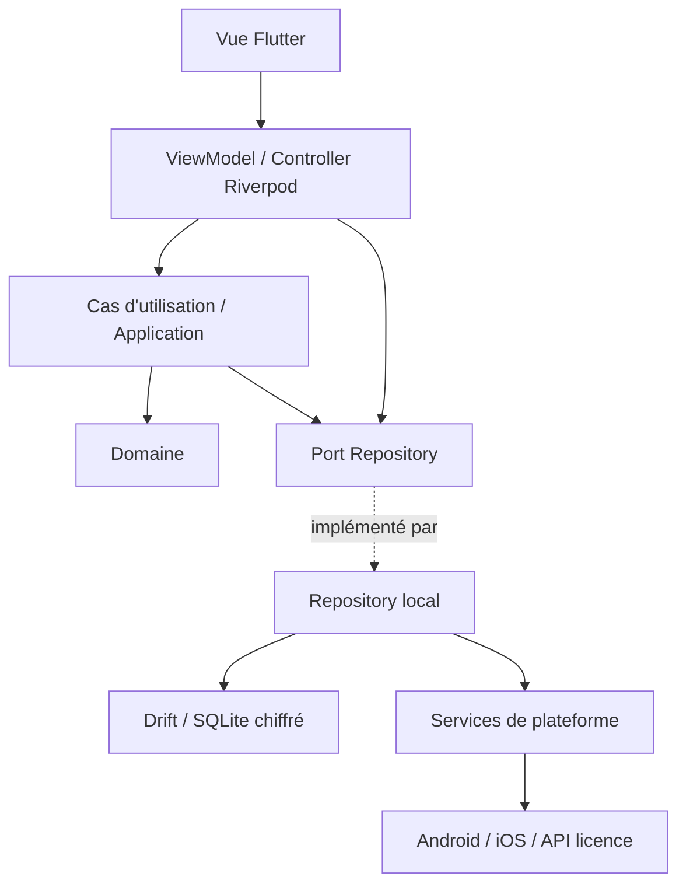
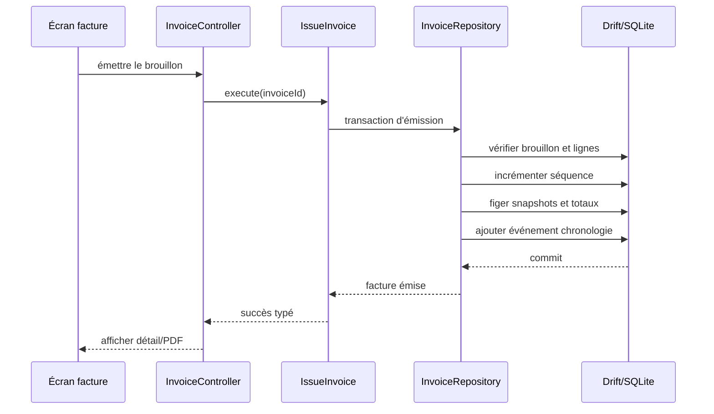

# Architecture technique de référence — SAMTECH CRM Starter

| Élément | Valeur |
|---|---|
| Statut | Architecture de référence avant prototypes techniques |
| Version | 1.0 |
| Date | 14 juillet 2026 |
| Cible | Flutter Android/iOS, offline-first |

## 1. Objectifs

L'architecture doit :

- isoler les règles métier de Flutter et des plugins ;
- offrir des parcours rapides sur des téléphones modestes ;
- fonctionner localement sans serveur métier ;
- garantir la cohérence des factures, paiements et migrations ;
- rendre les dépendances externes remplaçables et testables ;
- permettre la réutilisation des briques SAMTECH ;
- préparer le cloud V2 sans imposer sa complexité à la Starter.

## 2. Style architectural

SAMTECH CRM adopte une architecture **feature-first**, en couches, inspirée des recommandations Flutter :



La couche application est utilisée pour les opérations multi-entités ou sensibles : conversion, campagne, émission, paiement, sauvegarde et licence. Une lecture simple peut passer du ViewModel au port de repository sans créer un use case artificiel.

## 3. Couches et responsabilités

### 3.1 Présentation

Contient écrans, widgets, routes, ViewModels/Controllers et états d'interface.

Autorisé :

- Flutter, Riverpod, design system et navigation ;
- adaptation des modèles d'affichage ;
- validation de forme et orchestration d'une commande ;
- gestion chargement, vide, erreur et confirmation.

Interdit :

- SQL ou accès direct à Drift ;
- calcul financier métier ;
- appel direct à un plugin depuis un widget ;
- interprétation cryptographique d'une licence.

### 3.2 Application

Contient les cas d'utilisation et orchestre les transactions métier.

Exemples :

- `CreateContact` ;
- `ConvertProspectToClient` ;
- `CompleteFollowUp` ;
- `StartCampaign` ;
- `IssueInvoice` ;
- `RecordPayment` ;
- `CreateBackup` ;
- `ActivateLicense`.

Un cas d'utilisation reçoit des ports, valide les préconditions, démarre la transaction appropriée et retourne un résultat typé.

### 3.3 Domaine

Contient entités, value objects, politiques, erreurs métier et interfaces de repositories.

Il ne dépend ni de Flutter, ni de Riverpod, ni de Drift, ni d'un plugin. Les éléments critiques incluent :

- `Money`, `Quantity`, `PhoneNumber`, `InvoiceNumber` ;
- états et transitions Prospect, Relance, Campagne, Facture, Licence ;
- politiques de calcul de facture ;
- règles de conversion et d'éligibilité de campagne ;
- contrats de repositories et services.

### 3.4 Données et infrastructure

Contient les implémentations des ports :

- base Drift, tables, DAOs, mappers et migrations ;
- client HTTP de licence ;
- stockage sécurisé ;
- notifications locales ;
- génération PDF ;
- partage/URL WhatsApp ;
- chiffrement de sauvegarde ;
- horloge et génération d'identifiants.

Toute exception externe est convertie en erreur technique typée avant de franchir la frontière.

## 4. Règle des dépendances

```text
presentation → application → domain
presentation → domain (types d'affichage simples seulement)
data/infrastructure → domain (implémente ses ports)
app/bootstrap → toutes les couches pour la composition
domain → Dart uniquement
```

Deux fonctionnalités ne s'importent pas mutuellement par leurs dossiers internes. Elles communiquent via un use case partagé, un port de domaine ou un module d'orchestration explicite.

## 5. Organisation feature-first

Fonctionnalités prévues :

```text
activation
app_lock
onboarding
dashboard
contacts
catalog
follow_ups
message_templates
campaigns
customers
invoicing
payments
statistics
backup_restore
settings
```

Chaque fonctionnalité ne crée que les sous-couches dont elle a réellement besoin. Les éléments transversaux propres au CRM restent dans `core/` de l'application ; les composants réutilisables entre produits vont dans `packages/`.

## 6. Composition et injection

Riverpod sert à :

- construire et fournir les repositories et services ;
- gérer la durée de vie des ViewModels ;
- observer les flux Drift ;
- remplacer des dépendances par des fakes en test ;
- propager les états asynchrones de présentation.

Les providers sont déclarés près du module qu'ils composent. Le `ProviderScope` racine reçoit les overrides propres à l'environnement. Le domaine ne connaît aucun provider.

## 7. Gestion d'état

Trois catégories sont séparées :

1. **état persistant** : source de vérité Drift ;
2. **état applicatif** : session déverrouillée, licence, configuration ;
3. **état UI éphémère** : onglet, filtre, saisie et progression locale.

Les listes métier observent des flux de repository. Les commandes passent par des Notifiers/Controllers et exposent un état explicite. Aucun provider ne devient une base parallèle contenant tous les contacts ou toutes les factures.

## 8. Navigation

`go_router` fournit :

- les cinq destinations persistantes via une shell route ;
- routes typées ou helpers générés après prototype ;
- redirections démarrage → activation → configuration → déverrouillage → application ;
- liens internes depuis les notifications ;
- écran d'erreur de route sans fuite d'information.

Les guards lisent un état de session stable. Ils ne lancent pas directement une activation réseau pendant la résolution d'une route.

## 9. Persistance

Drift est la couche candidate au-dessus d'un SQLite chiffré. L'accès est organisé en :

- une instance de base par installation ;
- tables et migrations centralisées ;
- DAOs regroupés par agrégat ;
- repositories effectuant mapping ligne ↔ domaine ;
- transactions applicatives pour opérations critiques ;
- requêtes observables pour listes et indicateurs ;
- travail lourd hors du thread d'interface, à valider avec le moteur chiffré.

Aucune ligne Drift n'est exposée comme entité de domaine. Les snapshots financiers et JSON sont validés par version.

## 10. Services de plateforme

Chaque plugin est encapsulé derrière un port :

| Port | Implémentation candidate |
|---|---|
| `SecureStorage` | coffre Android/iOS via plugin sécurisé |
| `LocalAuthenticator` | biométrie et authentification locale |
| `NotificationScheduler` | notifications locales et fuseaux |
| `ExternalMessenger` | URL WhatsApp puis partage/copie de repli |
| `DocumentGenerator` | PDF |
| `ShareGateway` | feuille de partage native |
| `FilePickerGateway` | sélection/enregistrement natifs |
| `LicenseApi` | HTTP JSON versionné |
| `Clock` | horloge injectable |
| `IdGenerator` | UUID injectable |

Les appels natifs sont testés par contrat et tests d'intégration sur appareils.

## 11. Flux d'écriture critique

### Émission d'une facture



### Paiement

L'ajout ou l'annulation du paiement, le recalcul du solde, l'état de facture et l'événement de chronologie appartiennent à une même transaction.

### Campagne

Le démarrage fige destinataires et messages dans une transaction. Chaque progression est sauvegardée avant de passer au destinataire suivant.

## 12. Démarrage de l'application

```text
Bindings Flutter
  → configuration de build
  → initialisation logs expurgés
  → ouverture du coffre sécurisé
  → récupération/génération de la clé DB
  → ouverture et migration de la base
  → lecture de licence locale
  → création du ProviderScope
  → routage activation/configuration/PIN/application
  → réconciliation des notifications en arrière-plan contrôlé
```

Une erreur de base ou migration mène à un écran de récupération, pas à un tableau de bord partiellement initialisé.

## 13. Environnements

| Environnement | Usage | API licence | Données |
|---|---|---|---|
| `development` | développement local | mock ou sandbox | fictives |
| `staging` | QA et pilote interne | staging | fictives/pilote autorisé |
| `production` | boutiques | production | utilisateur |

Les URLs et clés publiques sont des paramètres de build non secrets. Les clés privées, tokens administrateur et secrets serveur ne sont jamais fournis au mobile.

## 14. Journalisation et observabilité

- logs structurés avec code, module et corrélation locale ;
- numéros, noms, notes, messages, PDF, clés et jetons expurgés ;
- niveau debug uniquement en développement ;
- export diagnostique volontaire et inspectable ;
- télémétrie distante absente par défaut en Starter ;
- crash reporting futur soumis au consentement et à la minimisation.

## 15. Performance

- listes paginées ou limitées ;
- recherche indexée et délai de frappe ;
- agrégats calculés par SQL, pas en mémoire sur toute la base ;
- génération PDF et sauvegarde hors rendu UI ;
- images redimensionnées avant stockage ;
- profilage sur base de 5 000 contacts, 10 000 événements et 2 000 factures au minimum pour le prototype, volumes à réviser avec le terrain.

## 16. Décisions différées aux prototypes

- moteur et intégration exacts du SQLite chiffré ;
- accès background/isolate avec chiffrement ;
- algorithme et bibliothèque de signature de licence ;
- KDF de sauvegarde et format d'enveloppe ;
- navigation typée par génération ;
- versions minimales Android/iOS en fonction des plugins retenus ;
- thème sombre dans le MVP.

## 17. Critères d'acceptation architecturaux

- le domaine se compile sans Flutter ;
- un repository peut être remplacé par un fake ;
- les calculs de facture sont testés sans base ;
- les migrations sont testées depuis chaque schéma supporté ;
- aucune dépendance native n'est appelée depuis un widget ;
- les scénarios P0 fonctionnent en mode avion après activation ;
- la base, le coffre et la licence échouent de façon récupérable ;
- Android et iOS exécutent les tests d'intégration des services natifs.

## 18. Références techniques vérifiées

- Guide officiel d'architecture Flutter : https://docs.flutter.dev/app-architecture/guide
- Guide Flutter offline-first : https://docs.flutter.dev/app-architecture/design-patterns/offline-first
- Riverpod : https://riverpod.dev/
- Drift : https://drift.simonbinder.eu/
- `go_router` : https://pub.dev/packages/go_router

