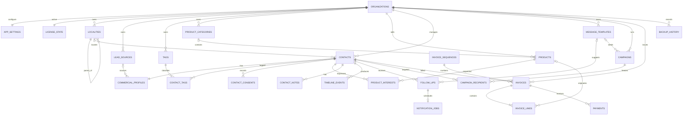

# Diagramme relationnel — SAMTECH CRM Starter

| Élément | Valeur |
|---|---|
| Statut | Modèle logique de référence |
| Version | 1.0 |
| Date | 14 juillet 2026 |

Le diagramme montre les relations principales. Les champs exhaustifs et règles de nullabilité sont dans `DATA_DICTIONARY.md`.

## Agrégats métier

### Contact

Racine : `contacts`. Enfants transactionnels : profil, tags, consentements, intérêts, notes, relances et événements. Factures et campagnes référencent le contact mais conservent leurs propres snapshots.

### Campagne

Racine : `campaigns`. Les `campaign_recipients` deviennent immuables quant à la sélection après démarrage, mais leur progression évolue.

### Facture

Racine : `invoices`. Les lignes appartiennent à la facture. Les paiements sont des enregistrements financiers séparés, annulables mais non supprimables silencieusement.

### Installation

`organizations`, `app_settings` et `license_state` décrivent l'installation Starter. Les données commerciales ne sont pas contenues dans le jeton de licence.

## Règles de cardinalité importantes

- Une organisation Starter possède un profil actif.
- Un contact possède un profil commercial exactement.
- Un profil client correspond toujours à un contact existant.
- Une facture possède au moins une ligne avant émission.
- Une ligne peut référencer un produit, mais le snapshot de ligne reste autonome.
- Un paiement appartient à une seule facture.
- Un contact apparaît au maximum une fois dans une campagne donnée.

