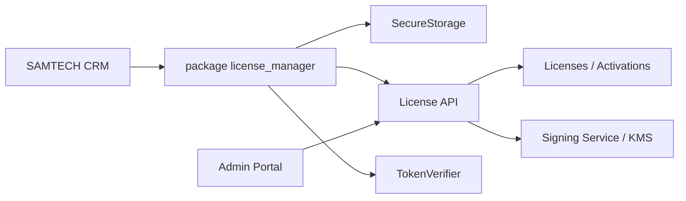
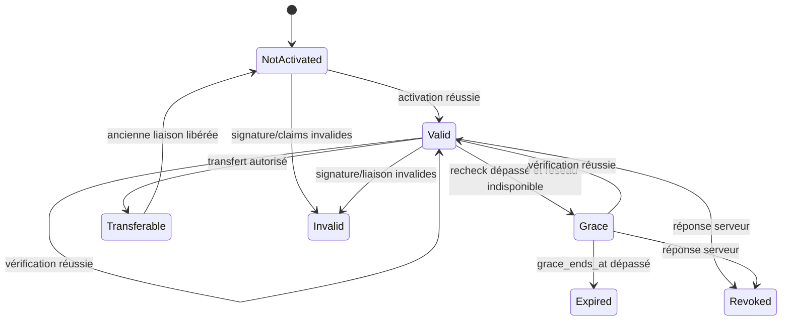

# Architecture du gestionnaire de licences

| Élément | Valeur |
|---|---|
| Statut | Protocole fonctionnel et technique de référence |
| Version | 1.0 |
| Date | 14 juillet 2026 |

## 1. Périmètre Starter

- une licence pour une édition et une application ;
- une activation autorisée par appareil/installation selon l'offre ;
- activation initiale en ligne ;
- jeton local signé vérifiable hors ligne ;
- vérifications périodiques et période de grâce ;
- révocation lors d'une connexion ;
- transfert administré ;
- export des données distinct de la licence.

## 2. Composants



Le package mobile contient les modèles, la machine d'états, le vérificateur et les ports. Le serveur et le portail sont des produits séparés et ne partagent jamais leur clé privée avec le mobile.

## 3. Identité d'installation

Ne pas utiliser un identifiant matériel permanent. Lors de la première installation :

1. générer un UUID d'installation ;
2. générer, si le protocole le permet, une paire de clés locale ;
3. stocker le matériel privé et l'identité dans le coffre natif ;
4. transmettre uniquement l'identifiant public ou son empreinte au serveur.

Une réinstallation peut créer une nouvelle identité et exiger un transfert/récupération. Cette conséquence est préférable à une collecte matérielle intrusive.

## 4. Jeton signé

Le format peut être JWS compact, COSE ou enveloppe canonique équivalente. Le choix final dépend du spike cryptographique.

Claims minimaux :

| Claim | Rôle |
|---|---|
| `token_version` | évolution du format |
| `issuer` | SAMTECH |
| `audience` | application mobile concernée |
| `license_id` | licence serveur |
| `activation_id` | liaison active |
| `edition` | `starter` |
| `app_id` | produit autorisé |
| `installation_thumbprint` | liaison à l'installation |
| `issued_at` | temps serveur |
| `not_before` | début de validité |
| `recheck_after` | prochaine vérification normale |
| `grace_ends_at` | limite offline absolue |
| `max_devices` | information d'offre |
| `key_id` | clé publique de vérification |

Le jeton ne contient ni nom client, ni téléphone, ni donnée CRM.

## 5. Machine d'états



Un jeton mal signé, destiné à une autre application ou autre installation est `invalid`, jamais simplement `expired`.

## 6. Activation

```text
Saisir clé
  → normaliser localement sans la journaliser
  → créer idempotency key
  → envoyer app/install/version/plateforme
  → serveur valide licence et quota
  → serveur crée ou retrouve activation idempotente
  → serveur signe le jeton
  → mobile vérifie signature, audience et liaison
  → mobile enregistre le jeton dans SecureStorage
  → état Valid
```

Le mobile ne stocke la clé saisie complète que si la politique de récupération l'exige explicitement ; le jeton suffit au fonctionnement courant.

## 7. Vérification périodique

- déclenchée au démarrage ou retour au premier plan lorsque `recheck_after` est dépassé ;
- jamais bloquante si la grâce locale valide s'applique ;
- une seule requête en vol ;
- backoff avec jitter pour erreurs temporaires ;
- pas de boucle agressive ;
- réponse serveur toujours revérifiée localement ;
- `last_server_time` mis à jour seulement après réponse authentique.

## 8. Horloge

Le client compare heure locale, dernier temps serveur et claims. Une horloge reculée de manière suspecte :

- ne prolonge pas la grâce ;
- demande une vérification en ligne ;
- ne supprime aucune donnée ;
- affiche une instruction de correction de date si pertinente.

Le serveur est la référence lors des échanges.

## 9. Révocation et restriction

La révocation devient connue lors d'une vérification. L'application passe dans un mode restreint défini par la politique :

- consultation limitée ou écran de licence ;
- possibilité d'activer une autre clé ;
- accès à l'assistance ;
- export sécurisé des données selon la politique validée ;
- aucune suppression des données.

## 10. Transfert

Flux proposé :

1. demande utilisateur/support ;
2. vérification de l'éligibilité et du propriétaire ;
3. création d'une autorisation courte ;
4. libération/révocation de l'ancienne activation ;
5. activation de la nouvelle installation ;
6. restauration séparée de la sauvegarde ;
7. journal d'audit.

Les limites et délais exacts sont des paramètres serveur, pas du code mobile figé.

## 11. Rotation des clés de signature

- chaque jeton porte un `key_id` ;
- l'application embarque un ensemble de clés publiques actuelles et de secours ;
- une mise à jour ajoute une nouvelle clé avant son utilisation serveur ;
- l'ancienne reste acceptée jusqu'à expiration des jetons concernés ;
- compromission : rotation urgente, réduction de grâce et mise à jour selon plan d'incident.

## 12. Portail administrateur

Fonctions minimales : créer/importer une licence, rechercher, voir activations, révoquer, autoriser transfert et consulter audit. MFA, rôles et justification sont requis pour les actions sensibles. Le portail n'accède jamais aux contacts, factures ou sauvegardes CRM.

## 13. Interface du package

Ports conceptuels :

```text
LicenseRepository
LicenseApi
LicenseTokenVerifier
InstallationIdentityStore
SecureStorage
Clock
NetworkExecutor
```

Use cases :

```text
LoadLocalLicense
ActivateLicense
EvaluateOfflineLicense
RefreshLicense
RequestTransfer
ClearInvalidActivation
```

## 14. Tests obligatoires

- tous les états et transitions ;
- jeton altéré, mauvais `key_id`, audience et installation ;
- activation répétée avec même idempotency key ;
- quota atteint ;
- réseau absent avant/après recheck/grâce ;
- horloge avancée/reculée ;
- rotation de clé ;
- révocation ;
- réinstallation et transfert ;
- données intactes dans tous les échecs.

## 15. Paramètres encore ouverts

- durée de grâce et fréquence de vérification ;
- algorithme et format du jeton ;
- politique d'essai ;
- nombre et fréquence des transferts ;
- mode restreint exact ;
- attestation de l'application/appareil ;
- règles d'achat et restauration propres aux boutiques.

