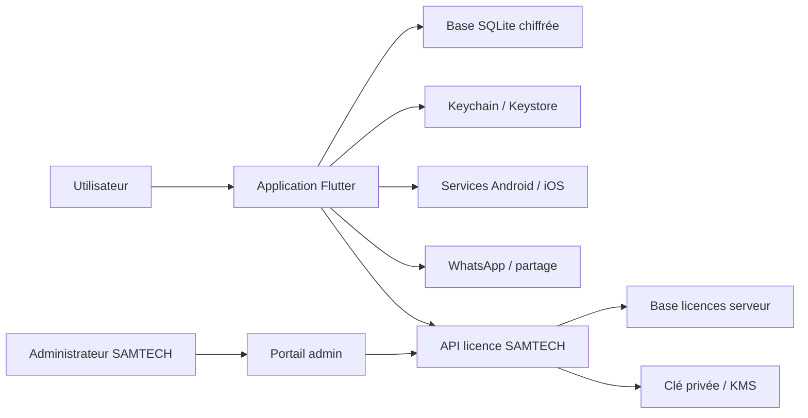

# Architecture de sécurité — SAMTECH CRM Starter

| Élément | Valeur |
|---|---|
| Statut | Modèle de menace et exigences de référence |
| Version | 1.0 |
| Date | 14 juillet 2026 |

## 1. Objectifs

Protéger :

- les contacts, notes, factures, paiements et sauvegardes ;
- la clé de chiffrement locale ;
- le PIN et les facteurs biométriques délégués au système ;
- l'intégrité et la portabilité contrôlée des licences ;
- les clés de signature et secrets serveur ;
- la disponibilité des données lors d'une erreur ou mise à jour.

La sécurité réduit le risque ; elle ne promet pas une invulnérabilité absolue sur un appareil entièrement compromis.

## 2. Frontières de confiance

WhatsApp, les applications de partage, le stockage choisi par l'utilisateur et l'appareil lui-même sont des frontières externes. Une fois un PDF partagé, son contrôle dépend du destinataire et de la plateforme.

## 3. Menaces principales

| Menace | Exemple | Réponse principale |
|---|---|---|
| Vol du téléphone | accès aux contacts | verrouillage système, PIN app, DB chiffrée |
| Extraction du fichier | copie de SQLite | clé séparée dans coffre natif |
| APK/IPA modifié | contournement licence | signature boutique, obfuscation et contrôles d'intégrité raisonnables ; un jeton signé empêche le forgeage face à un vérificateur honnête mais pas le patch du vérificateur |
| Clonage de licence | copie du jeton | liaison à une clé d'installation et signature serveur |
| Interception réseau | activation falsifiée | TLS et jeton asymétriquement signé |
| Serveur compromis | émission abusive | clés privées isolées, rôles, audit, rotation |
| Sauvegarde volée | lecture hors appareil | KDF et chiffrement authentifié |
| Bruteforce PIN | 6 chiffres | rate limit, KDF, coffre OS ; PIN non racine unique |
| Logs et support | fuite de données | redaction, export volontaire et minimal |
| Plugin vulnérable | accès non prévu | encapsulation, audit, mises à jour et moindre permission |
| Restauration hostile | archive malformée | authentifier, limiter, isoler et valider avant remplacement |

## 4. Classification des données

### Critique

Clé DB, secrets de sauvegarde, matériel privé d'installation, PIN verifier, clés privées serveur. Jamais dans les logs, analytics, Git ou configuration ordinaire.

### Confidentielle

Contacts, téléphones, notes, factures, paiements, messages préparés et PDF. Chiffrée au repos et minimisée lors du partage.

### Interne

Identifiants UUID, codes d'erreur, versions, métriques techniques expurgées.

### Publique

Clé publique de vérification, version de l'application, documentation commerciale.

## 5. Chiffrement local

- clé DB aléatoire générée avec un générateur cryptographique du système ;
- clé stockée dans Keychain/Keystore via un adaptateur testé ;
- base chiffrée par moteur maintenu et compatible Drift ;
- aucune clé dérivée uniquement du PIN faible ;
- verrouillage automatique de la session sans fermer/corrompre la base ;
- procédures de migration et rotation de clé testées ;
- fichiers temporaires, WAL et journaux couverts par le mécanisme choisi.

La restauration automatique Android du coffre doit être configurée afin d'éviter une clé restaurée sans matériel correspondant. La configuration exacte est validée dans le spike de sécurité.

## 6. PIN et biométrie

Le PIN protège l'accès dans l'application mais n'est pas l'unique racine cryptographique. Exigences :

- minimum initial recommandé de 6 chiffres, décision UX à tester ;
- sel aléatoire et KDF reconnue avec paramètres versionnés ;
- verifier stocké dans le coffre ou enveloppe protégée ;
- délai progressif après échecs ;
- aucune suppression automatique des données ;
- authentification biométrique déléguée au système via `local_auth` ;
- repli vers PIN ;
- nouvelle authentification pour restauration, changement de PIN et actions sensibles.

La procédure « PIN oublié » est une décision produit/sécurité ouverte. Elle ne doit pas permettre à un détenteur de la seule clé de licence de lire les données sans contrôle supplémentaire.

## 7. Réseau

- HTTPS/TLS uniquement ;
- validation standard de la chaîne système ;
- délais stricts et taille de réponse limitée ;
- JSON versionné et validation stricte ;
- idempotency key sur activation/transfert ;
- aucune clé privée dans le client ;
- pas de désactivation de TLS en production ;
- certificate pinning non retenu par défaut avant analyse de rotation et disponibilité ;
- les seules données couvertes par la signature du jeton restent vérifiables hors TLS ; les métadonnées externes ne le deviennent pas automatiquement.

## 8. Licence

Le serveur signe un jeton lié à une identité d'installation générée localement. Le matériel privé d'installation reste dans le coffre lorsque le protocole choisi utilise une preuve de possession. Un ensemble approuvé de clés publiques Ed25519, distribué par une chaîne authentifiée, vérifie le jeton hors ligne. Le JWS est signé, pas chiffré ; son contenu n'est pas confidentiel.

La clé privée SAMTECH n'est pas embarquée : modifier le client ne suffit donc pas à l'extraire, hors compromission distincte du serveur ou de la chaîne de build. Un client patché peut toutefois ignorer une décision locale. Une révocation n'est connue hors ligne qu'à la prochaine vérification ; la période de grâce borne ce risque.

## 9. Sauvegarde

- chiffrement authentifié ;
- KDF mémoire-dure ou solution équivalente validée ;
- paramètres et version de suite dans l'enveloppe ;
- mot de passe/clé jamais journalisé ;
- authentification du paquet avant interprétation ;
- extraction en zone temporaire sans chemin arbitraire ;
- restauration atomique ;
- licence exclue du transfert.

## 10. Partage et WhatsApp

- afficher destinataire et contenu avant ouverture ;
- encoder strictement l'URL ;
- ne pas affirmer un envoi ou une lecture ;
- utiliser le partage natif pour le PDF ;
- effacer les fichiers temporaires selon une politique documentée ;
- avertir que le document quitte le périmètre SAMTECH ;
- ne pas demander l'accès aux conversations ou contacts du téléphone sans besoin validé.

## 11. Permissions

Principe du moindre privilège :

- notifications demandées au moment utile ;
- biométrie facultative ;
- sélection de fichier par API système plutôt qu'accès global au stockage ;
- aucune permission contacts, SMS, microphone, localisation ou caméra dans la V1 sans nouvelle story ;
- permissions Android/iOS documentées et testées par version.

## 12. Durcissement de livraison

- signatures officielles et clés dans un coffre CI ;
- obfuscation et séparation des symboles de debug ;
- builds reproductibles autant que possible ;
- dépendances auditées ;
- configuration debug impossible en production ;
- endpoints production immuables par configuration signée de build ;
- protections d'intégrité comme signal de risque, jamais seule décision de sécurité ;
- root/jailbreak : avertissement ou restrictions proportionnées, pas effacement.

## 13. Serveur et portail de licences

- authentification forte de l'administrateur, MFA requis ;
- contrôle d'accès par rôle ;
- journal append-only des créations, révocations et transferts ;
- clé privée dans KMS/HSM ou secret manager avec accès minimal ;
- rotation de clés et publication d'un ensemble de clés publiques versionnées ;
- sauvegardes serveur et plan de reprise ;
- limitation de débit et détection d'abus ;
- séparation staging/production ;
- aucune donnée commerciale CRM sur le serveur de licences.

## 14. Logs et diagnostics

La façade de logs redige par défaut. Les identifiants corrélables sont aléatoires ou hachés avec une clé adaptée. Un export diagnostique est volontaire, prévisualisable et expire. Aucun crash report distant avant politique de confidentialité et consentement approprié.

## 15. Réponse aux incidents

1. qualifier impact, versions et clés concernées ;
2. préserver les preuves sans données inutiles ;
3. révoquer/faire tourner les secrets serveur si nécessaire ;
4. publier une mise à jour signée ;
5. informer les utilisateurs selon les obligations ;
6. documenter cause et actions ;
7. ajouter un test empêchant la régression.

## 16. Vérifications avant publication

- modèle de menace revu ;
- test extraction base/sauvegarde ;
- test mauvaise clé et jeton falsifié ;
- audit des permissions et logs ;
- analyse statique et dépendances ;
- tests root/jailbreak sans perte de données ;
- test rotation des clés de licence ;
- test migration du coffre sécurisé ;
- procédure de support et récupération validée ;
- revue externe ciblée avant commercialisation si possible.

## 17. Points ouverts

- KDF exacte du PIN et de la sauvegarde ;
- processus opérationnel de rotation des clés Ed25519 ;
- politique PIN oublié ;
- durée de grâce ;
- rôle éventuel de l'attestation Play Integrity/App Attest ;
- politique de capture d'écran sur écrans sensibles ;
- versions minimales des OS.
